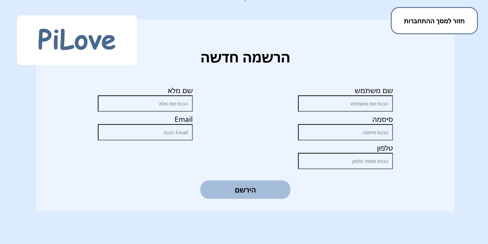

<h1>PiLove</h1> 

## 1. רעיון האתר - 
האתר שבנינו, PiLove, מהווה פלטפורמה עבור מתאמני מכון הפילאטיס ומאפשר להם לנהל את התורים (השיעורים) שלהם.

## 2. סדר הפעולות:
1. דף הנחיתה של האתר הינו דף ההתחברות. במידה ואין לו משתמש קיים, הוא יכול להירשם.
2.  המשתמש מועבר אל דף הבית דרכו יוכל לנווט באתר.
3. המשתמש יוכל לעיין בלוח השיעורים ולקבוע שיעור.
4. המשתמש יוכל לראות את כל השיעורים העתידיים שלו וקיימת אפשרות לבטל שיעור.
5. המשתמש יוכל לראות את כמות השיעורים שנותרה לו בכרטיסיה וקיימת אפשרות להזמין עוד שיעורים.

## 3. המסכים באתר:
*מסך ההתחברות לאתר*

*מסך ההרשמה לאתר*

*מסך הבית*

*מסך קביעת שיעור - המשתמש יכול לעיין בלוח השיעורים על ידי לחיצה על הכפתור היום הקודם/הבא. בכדי לקבוע שיעור עליו ללחוץ על השיעור הרצוי (לא ניתן להירשם לשיעורים שכבר התקיימו)*

*מסך קצת עלינו*

*מסך השיעורים שלי - מציג למשתמש את כל השיעורים העתיידים שלו, וקיימת האפשרות לביטול השיעור*

*מסך החשבון שלי - מפרט את כמות השיעורים שיש למשתמש*

*מסך הזמנת שיעורים - המשתמש יכול להזמין שיעורים נוספים לכרטיסיה שלו*

